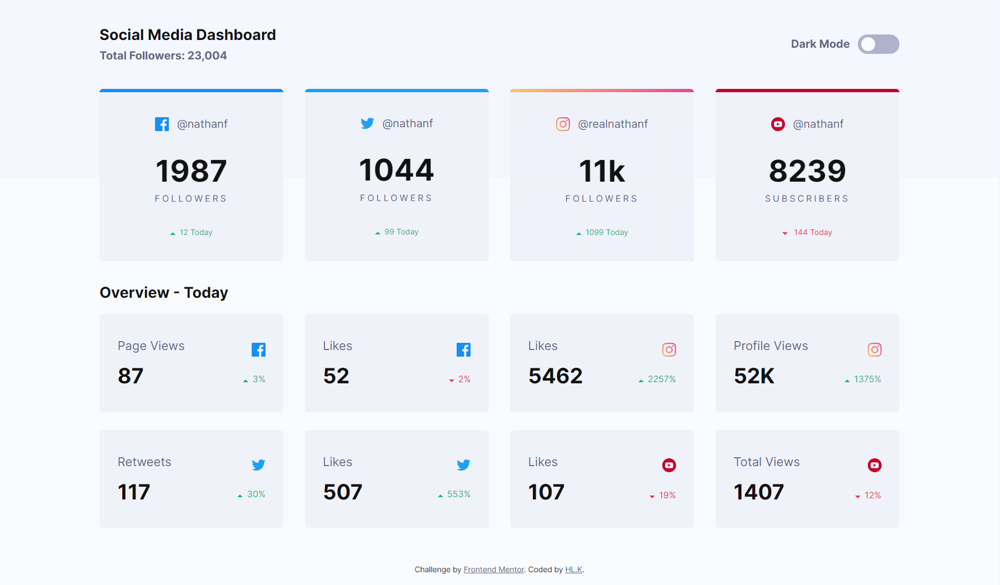
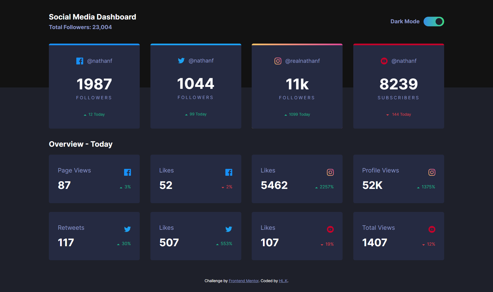
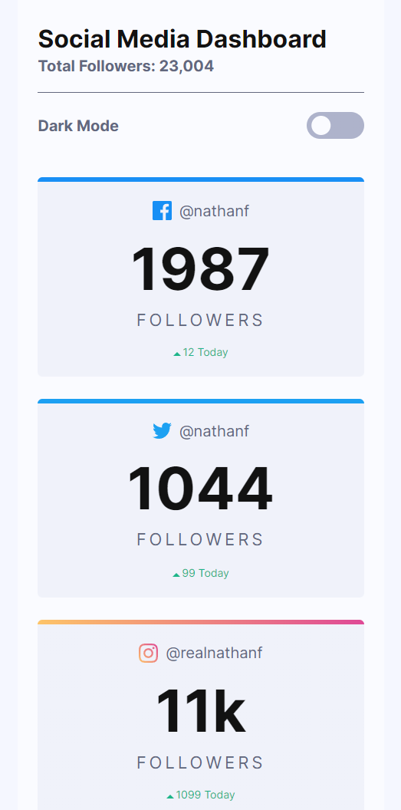
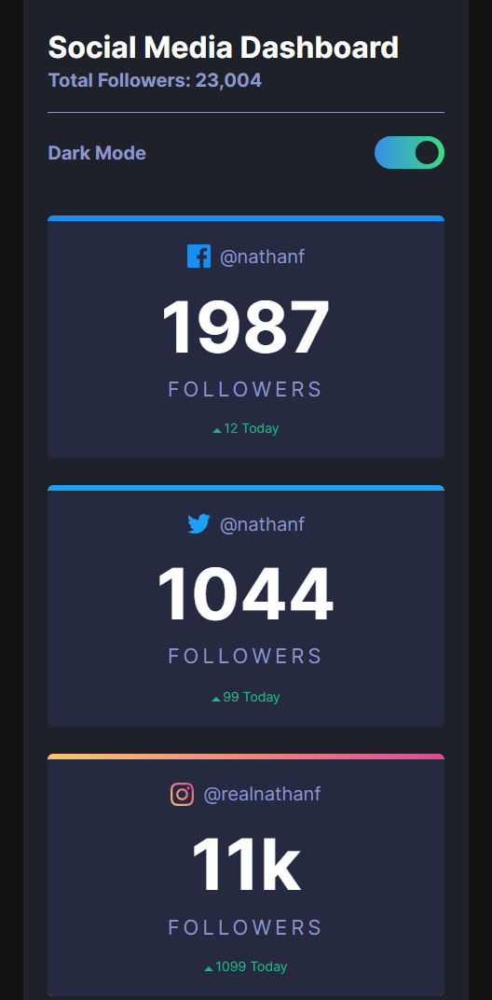

# Social Media - 반응형 웹 페이지

### Description

Flex box와 Media Query를 사용하여 반응형 웹 페이지로 제작하였고,  
Toggle Button을 사용하여 사용자가 원하는 테마로 변경할 수 있게 구현하였다.

## 제작 기간

2022.08.03 ~ 08.05

## Language

- HTML
- CSS
- JavaScript

## 디자인 및 소스 참고

[Frontend Mentor](https://www.frontendmentor.io/)

## Preview

\*배포 사이트 : https://hiimhl.github.io/Social-media/

 
Desktop

 

Mobile

